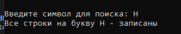
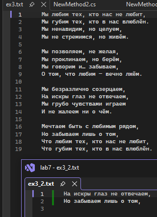
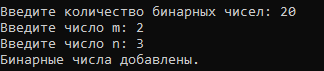
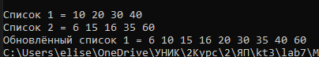

# Мартелов Елисей Группа ИТС1 Лабораторная №7

## Задание 1

### Задача 1

### Текст задачи

#### Найти разность максимального и минимального элементов. Элементы записываются каждый с новой строки.

### Алгоритм решения

#### В классе NewMethod1 создаётся статический метод GenWrite1 с параметрами. В нём создание перменной, создание класса Random, создание экземпляра класса StreamWriter для записи в текстовый файл. Далее блок обработки исключений доступа к файлу try\catch, в цикле while записываются значения в файл с новой строки используя класс Random.Закрытие файла writeFile1.Close();
#### В статическом методе GetDiff передаётся путь к файлу, создание переменных для присваивания к ним min, max, блок исключений try\catch, цикл while следует пока строки не закончатся, текущая строка преобразуется в целое число и сохраняется в переменную current. Сравнение текущего числа с min, max. Закрытие файла readFile1.Close();

### Тестирование

## Задание 2

### Задача 1

### Текст задачи

#### Вычислить минимальный элемент. При этом в одной строке может быть несколько элементов.

### Алгоритм решения

#### В статичном методе GetWrite2 работает всё так же как и в GenWrite1 за исключением цикла while, в нём для динамичной записи несколько чисел в строчку и в несколько строк используется условие: сначала записывает число в строчку, затем в цикле if генерирует случайное число(от 1 до 15) и если 'x' кратен этому числу переносит строку. Закрытие файла writeFile.Close();
#### В статичном методе GetMin всё такой же блок обработки try\catch. В цикле while создаётся массив и разделяется на массив подстрок mass = s.Split(" "); Затем в цикле for проходит по длинне массива и в цикле if проверяет, что элемент != пустой строке: тогда текущую строку преобразует в целое число и сохраняется в переменную current, сравнивает с min и если меньше заменят min на current.

### Тестирование

## Задание 3

### Задача 1

### Текст задачи

#### Переписать в другой файл строки, начинающиеся с заданного символа

### Алгоритм решения

#### В статическом методе Copy передаются 2 пути к файлам, символ для поиска(в этом методе сразу чтение из файла и запись результата в новый). Создаётся класс для записи(writeFile) и для чтения(readFile), значение bool для обратной связи(поможет для вывода в консоль ответа: нашлись ли строчки с текущим символом). Такой же блок обработки исключений try\catch. В цикле while идёт пока файл не будет пуст, в условии if проверяется не пуста ли строка и первый символ строки превращает в строчную букву и сравнивает её с вводимым пользователем сивола(тоже прописная). Записывает эту строку в новый файл writeFile и поднимает флаг a = true. В самом конце обратная связь, если a(bool) = false то выведет что не найдены строчки на такую букву, и на оборот. Закрытие файлов.

### Тестирование

## Задание 4

### Задача 1

### Текст задачи

#### Получить в новом файле все компоненты исходного файла, которые делятся на m и не делятся на n

### Алгоритм решения

#### В статическом методе GenBin передаётся путь файла, количество чисел. Такой же блок обработки исключений, но в try открывается файл и присваивается к нему модификатор файла - создание. В цикле for записываются случайные компоненты(от 1 до 100) в строчку.
#### В стат методе ReadBin передаётся 2 пути файла и значения пользователя m и n. В блоке try binaryReader открывается в режиме чтения, а второй в режиме создания. В цикле while файл для чтения(binaryReader) вычисляет текущую позицию и если она меньше всё длинны идёт дальше. Компонент файла считывает 4 байта и интерпретирует их как целое число и в условии проверят целочисленное деление на m и неделение на n. Записывает в плотный поток байтов. Выводит обратную связь в консоль.Закрывает файлы.

### Тестирование

## Задание 6

### Задача 1

### Текст задачи

#### Даны упорядоченные списки L1 и L2. Вставить элементы списка L2 в список L1, не нарушая его упорядоченности.

### Алгоритм решения

#### В новом классе NewMethod2 в статическом методе ListCopy происходит создание двух списков с значениями. Вывод двух этих списков для пользователя. Далее во внешнем цикле for проход по всем элементам списка №2, создание флага bool = false(для того чтобы если элементов во 2 списке больше, то он их всё равно учёл бы). Во внутреннем цикле проходит по всем элементам списка №1 и выполняет условие если элемент по i второго списка меньше элемента j первого списка, то вставляет элемент списка2 в список 1, поднимает флаг. if флаг = false то добавляет крупный элемент в конце первого списка.

### Тестирование

